# 안녕하세요 🙇‍♀️

그 무엇보다 새로운 도전을 많이 시도했었던 2023년이 지나갔습니다.

이번 글에서는 2023년에 무엇을 했는지 스스로를 되돌아보는 시간을 가져보고자 합니다.

# 1분기

### 새해 여행

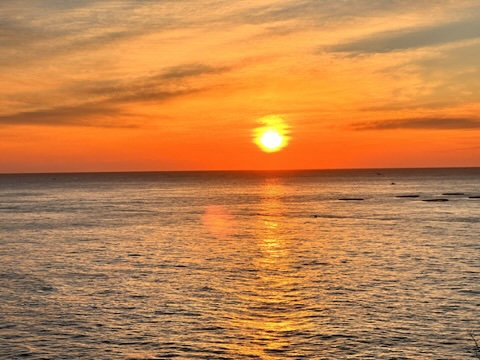

- 새해를 맞이하여 동해로 여행을 갔었습니다.
- 재미있었는데… 잠을 자느라 1월 1일의 해는 보지 못하고 1월 2일의 해를 보았다는 슬픈 전설이 있었습니다. 내년에는 꼭 일찍 일어나서 1월 1일의 해를 보도록 하겠습니다 와자뵤.

### 네이버 Deview 2023

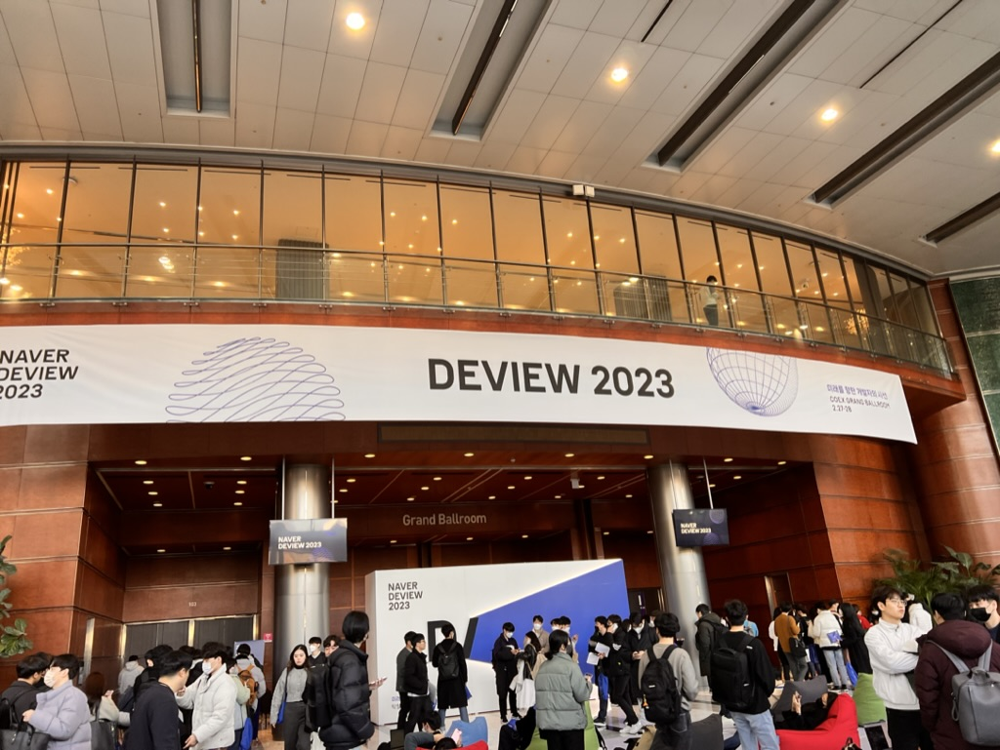

- 네이버에서 주최한 DEVIEW에 참석했습니다.
- 네이버 스마트 에디터, 클로바 노트와 같은 여러 기술들이 어떻게 만들어졌는지 보는 귀중한 시간이였습니다.
- 원래는 1일차 백엔드 세션에 티케팅을 성공했는데, 네이버 평화나라에서 2일차를 가지신 분과 교환을 해서 제법 행복했습니다.

### 이직준비! 하지만 밖은 차가웠다!

- 회사의 여러 힘든 사정으로 인하여 이직을 준비했습니다.
- 많은 회사에 지원서를 넣었지만 밖은 차가웠고… 대부분 쓴 맛을 맛보았던 것 같습니다.
- 지금 와서 회상해보면, 기술에 대해서 조금만 더 공부를 했다면 결과가 달라지지 않았을까? 라는 생각이 있긴 합니다.

# 2분기

### 성수 밋업에서의 발표

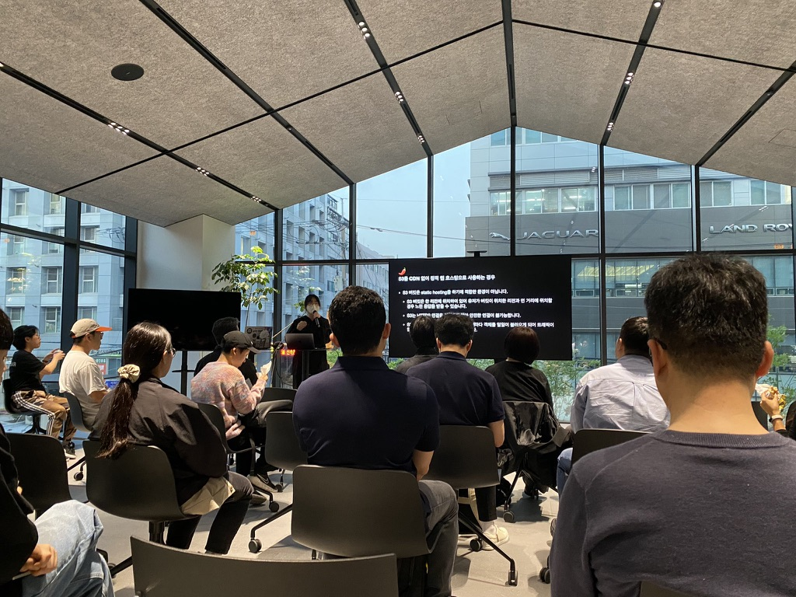

- 평소에 자주 참여하던 AWSKRUG 성수소모임에 발표를 해보았습니다.
- [SI에서 배운 AWS 안티패턴](https://www.notion.so/SI-AWS-7c4a71a6f0454643aac2c7d07177c0d2?pvs=21) 을 주제로 발표했고, AWS에서 저지르기 쉬운 안티패턴을 알려주는 글이였습니다.
- 제 발표의 빈틈을 찌르는 질문도 있었어서 재미있었던 기억이 납니다.

### 제주도 여행

- 결국 이직에 성공했습니다. 꿈 ⭐ 은 이루어진다…
- 이직에 성공한 기념으로 제주도로 10박 11일 여행을 갔고, 생각보다 더 재미있는 시간을 보냈습니다.
- 하지만… 혼자서 하는 제주도 여행은 꽤나 지루하다는 사실과 함께 다음에는 꼭 같이 갈 사람을 모집해야겠다는 생각을 하기도 했습니다.

### 안정적인 직장에서의 첫 생활

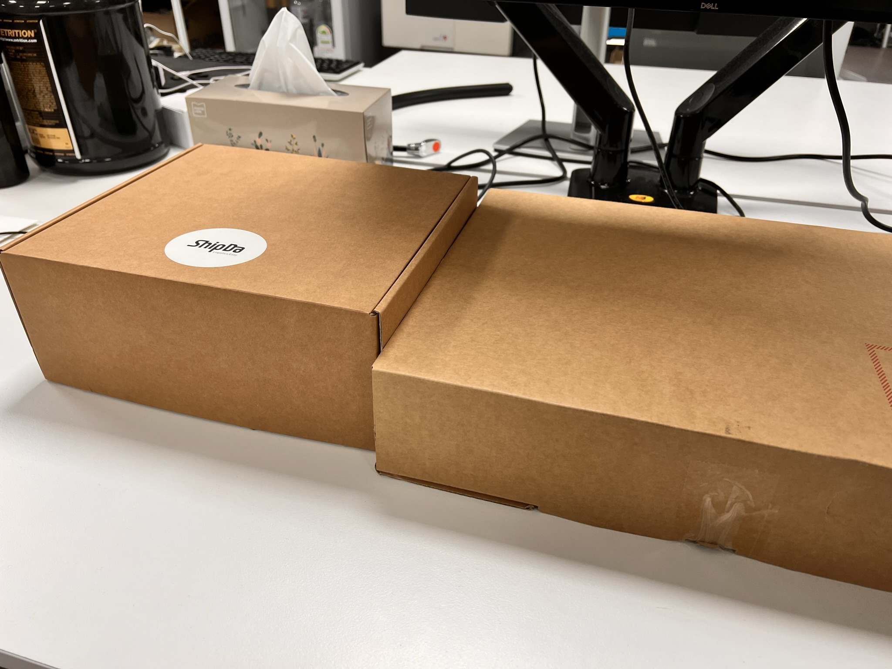

- 이직한 회사는 물류를 다루는 쉽다 라는 서비스를 운영하는 셀러노트였습니다.
- 놀랍게도 월급이 밀리지 않았고, 소통도 정상적으로 이루어지는 모습에 놀랐었던 기억이 납니다.
- 처음에는 실수도 많이 하고, 얼렁뚱땅 굴러갔지만 결과적으로 잘 적응했고, 수습에서도 좋은 결과가 있었습니다.

# 3분기

### 웰컴 투 채널코퍼레이션!

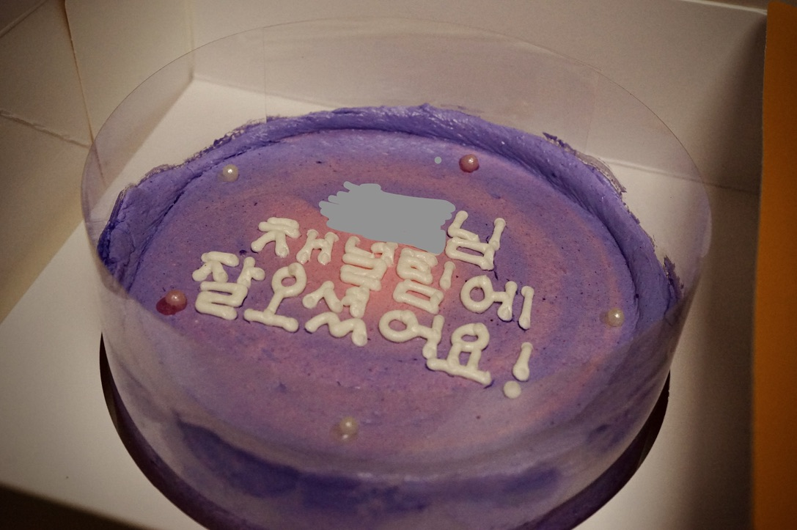

- 셀러노트에서의 생활을 만족하던 중, 3개월전에 지원했던 채널톡에서 오퍼가 왔습니다.
- 가볍게 커피챗만 하고 넘겨야지~~ 라고 생각했지만, 생각보다 더 많은 이야기를 했고, 결과적으로는 채널팀에 합류하게 되었습니다.

### 새로운 취미 : 에어소프트

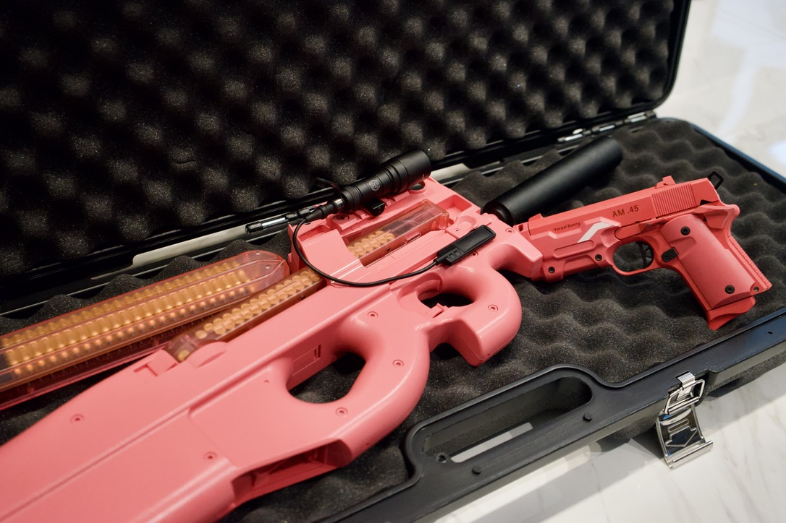

- 에어소프트 게임 (서바이벌)에 발을 들이게 되었습니다.
- BB탄으로 상대를 맞추는 일종의 대전 경기인데, 꽤나 운동도 되어서 재밌었던 기억이 나곤 합니다.
- 여러분들도 한번 해보실래요?

### 대학에 진학했어요

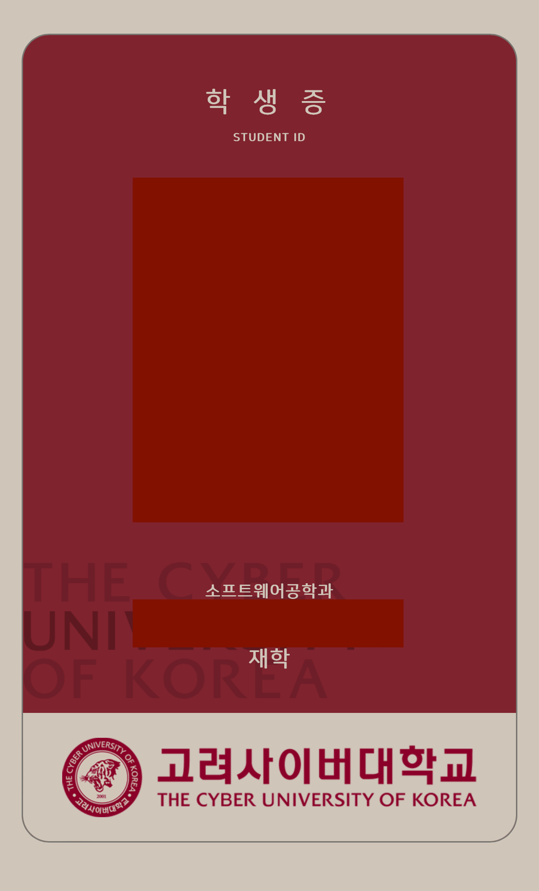

- 고려사이버대학교 학적부에 이름을 올렸습니다.
- 1학년 1학기의 패기로 18학점을 올렸으나… 회사와 공부를 병행한다는 현실의 벽은 생각보다 더 높았습니다.
- 다음 학기부터는 12~15학점 정도로 줄여야겠다… 라는 생각을 했습니다.

### 야구를 봤어요

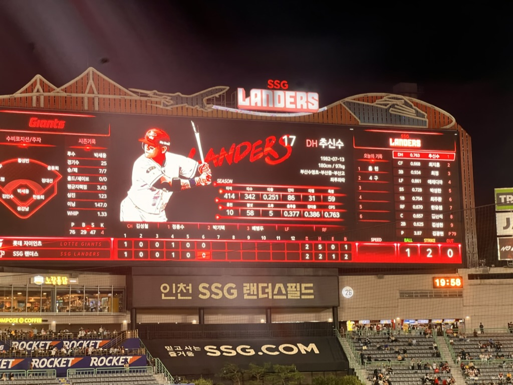

- TMI지만… 저는 롯데자이언츠를 좋아합니다.
- 야구를 봤었고, 너무너무 재미있었습니다.
- 심지어 이날은 승리했습니다. 와자뵤.

# 4분기

### 인생 첫 자취

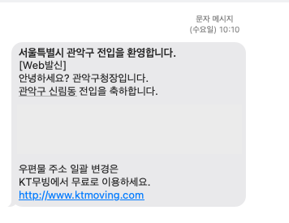

- 본가에서 회사로 출퇴근하기가 어려워져 인생 처음으로 자취를 시작하게 되었습니다.
- 신경써야 할것도 많았지만, 제가 원하는 대로 집을 꾸밀수 있다는 성취감이 저를 더욱 행복하게 만들었습니다.
- 하지만… 고정비가 생각보다 많이 들어 조금은 힘들어졌습니다 >\_ㅜ

### 채널네컷, 성공적!

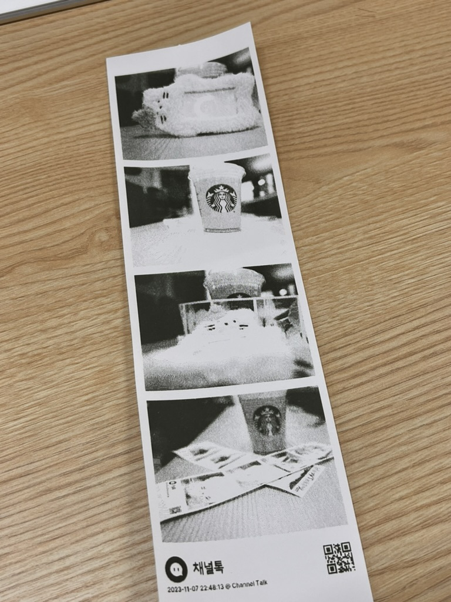

- 회사에서 이벤트 용으로 인생네컷을 바탕으로 한 어플리케이션을 만든다는 기획을 했습니다.
- 영수증 프린터와 SonyCamera API를 사용하여 성공적으로 완성했던 기억이 납니다.
- https://github.com/nabi-chan/ch-four-cuts 에 모든 소스코드가 공개되어 있습니다.

### 수채화 클래스

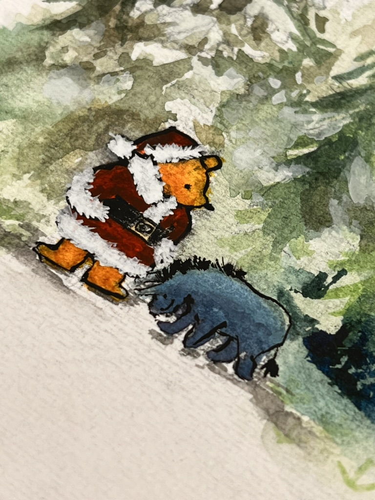

- 회사에서 진행하는 수채화 클래스에 당첨되어 즐거운 마음으로 그림을 그렸습니다.
- 생각보다 잘 안그려져서 힘들었지만… 선생님의 하드캐리로 그림을 잘 마무리 했었던 기억이 납니다.
- 결과적으로 멋진 그림이 나와서 꽤나 즐거웠던 기억이 납니다.

# 내년에는?

- 더 좋은 개발자가 되기 위해 많은 기술들을 배워보고자 합니다.
- 올해보다 더 많이 글을 써보려고 노력을 해보고 싶습니다… 적어도 한달에 한개라도…
- 블로그를 새롭게 또! 개편해보고 싶습니다. 이번에는 좋은 아이디어도 잔뜩 마련되어 있기에… 기대해주세요
- DevOps라는 새로운 분야에 발을 들여볼 생각입니다. 한번 가보자고요
