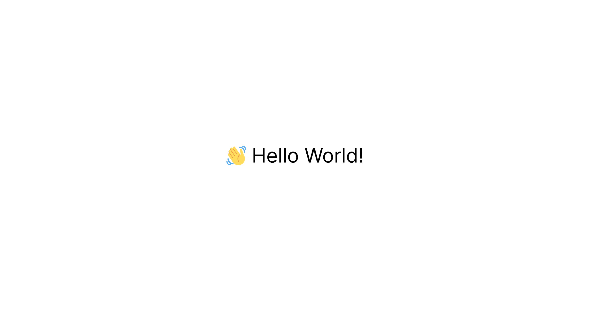
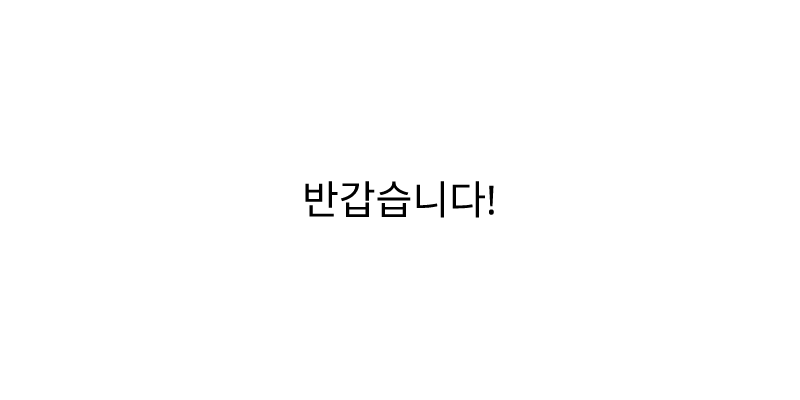
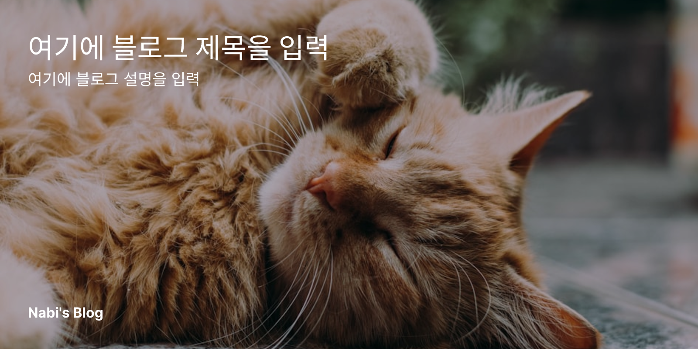
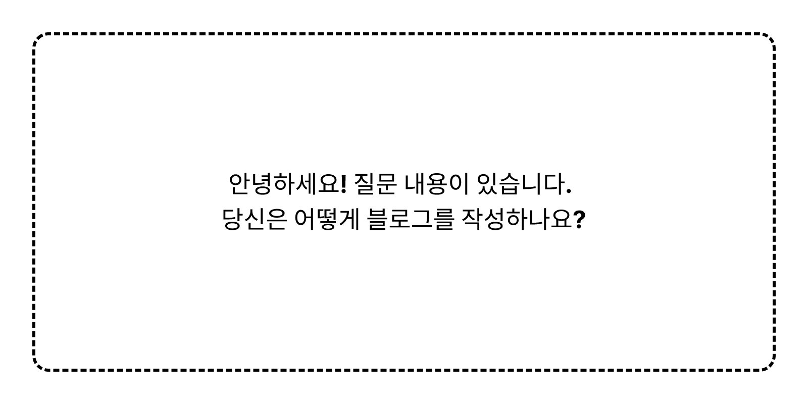

## @vercel/og 란 무엇일까

Vercel에서 제작한 SVG 형태의 이미지 제작 라이브러리인 Satori를 NextJS 환경에서 원활하게 사용할 수 있도록 설정을 추가해 resvg 없이도 png 형태의 이미지를 쉽게 제작할 수 있는 OpenGraph에 최적화된 라이브러리 입니다.

## 어떻게 사용할까

### 기본적인 사용법

- vercel/og 는 기본적으로 edge runtime 에 최적화 되어있습니다.
- 다음과 같이, runtime을 edge로 설정하고, `new ImageResponse()` 를 호출하여 이미지를 만들어낼 수 있습니다.
- 일반 react 환경에서 inline-style을 추가할 때 처럼, style 객체를 사용해 스타일을 지정해줄 수 있습니다.

```tsx filename="example.tsx"
import { ImageResponse } from '@vercel/og';

export const config = {
  runtime: 'edge',
};

export default async function handler() {
  return new ImageResponse(
    (
      <div
        style={{
          fontSize: 40,
          color: 'black',
          background: 'white',
          width: '100%',
          height: '100%',
          padding: '50px 200px',
          textAlign: 'center',
          justifyContent: 'center',
          alignItems: 'center',
        }}
      >
        👋 Hello World!
      </div>
    ),
    {
      width: 1200,
      height: 630,
    },
  );
}
```



### 이미지 리사이즈 하기

- option의 필수 인자인 `width` 와 `height` 를 조작함으로써 이미지의 크기를 결정할 수 있습니다.
- 이 예제에서는 400x400의 이미지를 반환합니다.

```tsx filename="resize.tsx"
import { ImageResponse } from '@vercel/og';

export const config = {
  runtime: 'edge',
};

export default async function handler() {
  return new ImageResponse(
    (
      <div
        style={{
          fontSize: 40,
          color: 'black',
          background: 'white',
          width: '100%',
          height: '100%',
          padding: '50px 200px',
          textAlign: 'center',
          justifyContent: 'center',
          alignItems: 'center',
        }}
      >
        👋 Hello World!
      </div>
    ),
    {
      // 이 부분의 값을 수정하면 다양한 사이즈의 이미지를 만들 수 있습니다.
      width: 400,
      height: 400,
    },
  );
}
```


### 커스텀 폰트 사용하기

- font 파일을 fetch 함수를 통해 가져올 수 있습니다.
- ttf / woff 등의 다양한 폰트 형식을 가져올 수 있습니다.
- font 파일은 api를 호출하는 폴더와 동일한 경로에 있어야 합니다.
  - 만약 `fetch('./font.woff', import.meta.url)` 의 형식으로 실행할 경우…
  - font.woff 파일은 api를 호출하는 폴더와 같은 공간에 있어야 합니다.

```tsx filename="custom-font.tsx"
import { ImageResponse } from '@vercel/og';

export const config = {
  runtime: 'edge',
};

export default async function handler() {
  // new URL() 을 통해 font.woff의 주소를 가져올 수 있게 됩니다.
  // 자세한 내용은 : https://developer.mozilla.org/ko/docs/Web/JavaScript/Reference/Operators/import.meta#현재_파일을_기준으로_파일_확인하기
  const fontBuffer = await fetch(new URL('pretendard-bold.woff', import.meta.url)).then((res) => res.arrayBuffer());

  return new ImageResponse(
    (
      <div
        style={{
          fontSize: 40,
          color: 'black',
          background: 'white',
          width: '100%',
          height: '100%',
          padding: '50px 200px',
          textAlign: 'center',
          justifyContent: 'center',
          alignItems: 'center',
        }}
      >
        👋 Hello World!
      </div>
    ),
    {
      width: 400,
      height: 400,
      // 배열에 다양한 굵기 / 형태의 폰트를 추가할 수 있습니다.
      fonts: [
        {
          data: fontBuffer,
          name: 'font',
          weight: 400,
        },
      ],
    },
  );
}
```


### 동적인 내용 가져오기

- 사용자가 입력한 내용에 따라 이미지를 만들고 싶다면, searchParams를 통하여 동적인 이미지를 만들 수 있습니다.
  - searchParams이란? `https://nabi-blog.vercel.app?query=hello` 라는 URL이 있을 때, query와 같이 ? 뒤에 붙는 내용을 뜻합니다.
- `new URL(request.url).searchParams.get("가져올_searchParam의_이름")` 을 통하여 사용자가 입력한 내용을 가져올 수 있습니다.

```tsx filename="dynamic-content.tsx"
import { ImageResponse } from '@vercel/og';

export const config = {
  runtime: 'edge',
};

export default async function handler(request: Request) {
  const query = new URL(request.url).searchParams;
  const content = query.get('content') || 'Type Some Content...';

  return new ImageResponse(
    (
      <div
        style={{
          fontSize: 40,
          color: 'black',
          background: 'white',
          width: '100%',
          height: '100%',
          padding: '50px 200px',
          textAlign: 'center',
          justifyContent: 'center',
          alignItems: 'center',
        }}
      >
        {content}
      </div>
    ),
    {
      width: 800,
      height: 400,
    },
  );
}
```



## 실전에서 사용해보기

### 블로그 미리보기 만들기

이미지를 불러오고, dim 처리를 함으로써 예쁜 블로그 미리보기를 만들 수 있습니다.

```tsx filename="blog-preview.tsx"
import { ImageResponse } from '@vercel/og';

export const config = {
  runtime: 'edge',
};

export default async function handler(request: Request) {
  const query = new URL(request.url).searchParams;
  const title = query.get('title') || '블로그 제목';
  const content = query.get('content') || '블로그 내용';

  return new ImageResponse(
    (
      <div
        style={{
          height: '100%',
          width: '100%',
          display: 'flex',
          flexDirection: 'column',
          justifyContent: 'space-between',
          padding: 32,
          backgroundColor: '#fff',
          color: '#fff',
        }}
      >
        {/* 배경화면 */}
        
        {/* dim 처리 */}
        <div
          style={{
            width: '100vw',
            height: '100vh',
            position: 'absolute',
            backgroundColor: 'rgba(0, 0, 0, 0.3)',
          }}
        />
        {/* 본문 */}
        <div
          style={{
            display: 'flex',
            flexDirection: 'column',
          }}
        >
          <span
            style={{
              fontSize: 32,
              fontWeight: 600,
            }}
          >
            {title}
          </span>
          <span
            style={{
              fontSize: 18,
            }}
          >
            {content}
          </span>
        </div>

        <div
          style={{
            fontSize: 16,
            fontWeight: 600,
          }}
        >
          Someone's Blog
        </div>
      </div>
    ),
    {
      width: 800,
      height: 400,
    },
  );
}
```



### 질문 미리보기 만들기

간단한 디자인을 통해, ask.fm 같은 질문 미리보기를 만들수도 있습니다.

```tsx filename="question-preview.tsx"
import { ImageResponse } from '@vercel/og';

export const config = {
  runtime: 'edge',
};

export default async function handler(request: Request) {
  const query = new URL(request.url).searchParams;
  const questionID = query.get('id') || '0';

  // DB에서 내용을 가져올 수 있습니다.
  const question = await database.findOne(questionID);

  return new ImageResponse(
    (
      <div
        style={{
          width: '100vw',
          height: '100vh',
          backgroundColor: '#fff',
          padding: 32,
          display: 'flex',
        }}
      >
        <div
          style={{
            width: '100%',
            height: '100%',
            border: 'dashed 3px black',
            borderRadius: 16,
            display: 'flex',
            flexDirection: 'column',
            justifyContent: 'center',
            alignItems: 'center',
            whiteSpace: 'pre-wrap',
            fontSize: 24,
            fontWeight: 700,
          }}
        >
          {question}
        </div>
      </div>
    ),
    {
      width: 800,
      height: 400,
    },
  );
}
```



## 트러블슈팅

### 오류 메시지 디버깅 하기

- 오류의 중간에 `[cause]: Error` 로 시작하는 문구를 발견할 수 있습니다.
  - 이 예제에서는 `Expected <div> to have explicit "display: flex" or "display: none" if it has more than one child node.` 자식이 1개 이상일때는 `display: “flex”` 또는 `“none”` 을 설정하라는 오류입니다.

```text filename="error.txt"
⨯ Error: failed to pipe response
    // 길고 긴 스택 트레이스
 ➡️ [cause]: Error: Expected <div> to have explicit "display: flex" or "display: none" if it has more than one child node.
      at qt (webpack-internal:///(middleware)/./node_modules/next/dist/compiled/@vercel/og/index.edge.js:16218:13)
      at qt.next (<anonymous>)
      at wl (webpack-internal:///(middleware)/./node_modules/next/dist/compiled/@vercel/og/index.edge.js:17130:20)
      at async render (webpack-internal:///(middleware)/./node_modules/next/dist/compiled/@vercel/og/index.edge.js:18780:15)
      at async Object.start (webpack-internal:///(middleware)/./node_modules/next/dist/compiled/@vercel/og/index.edge.js:19007:25)
}
```
