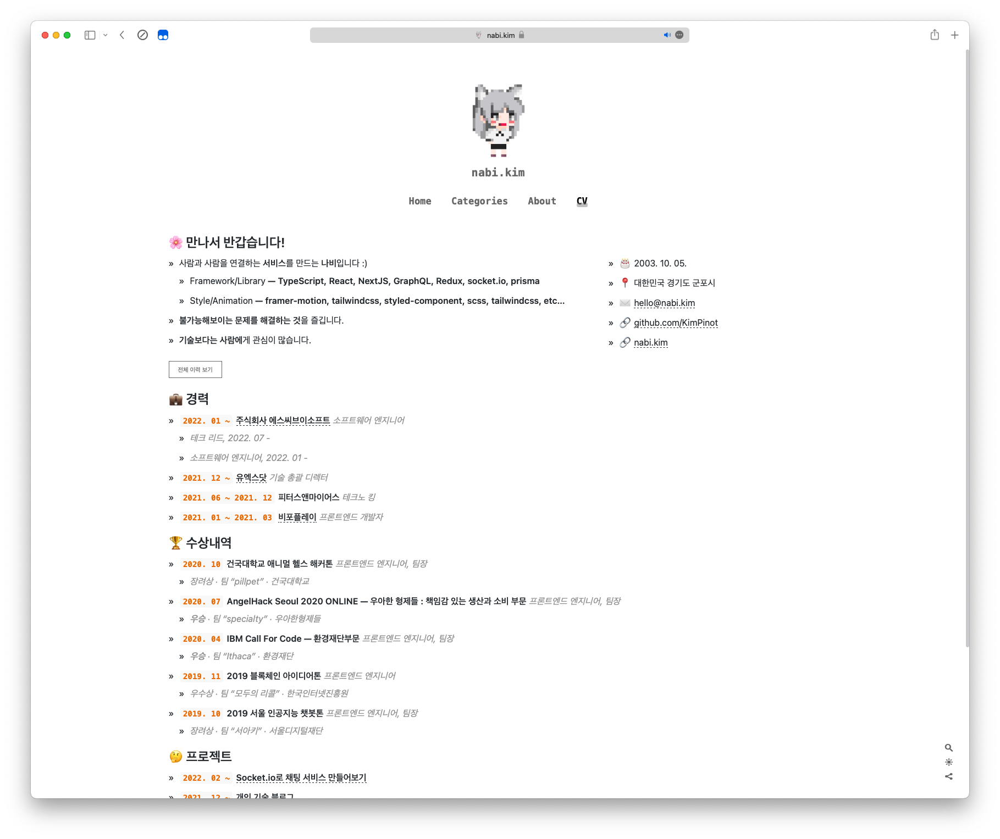
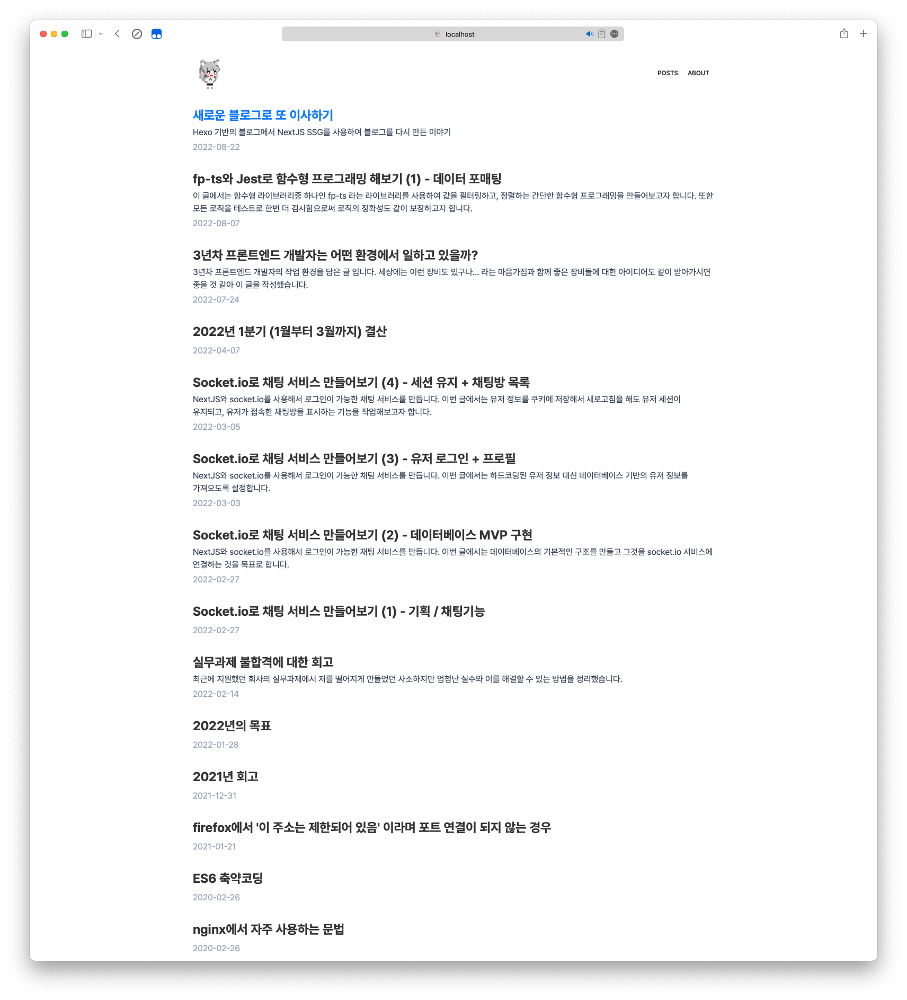
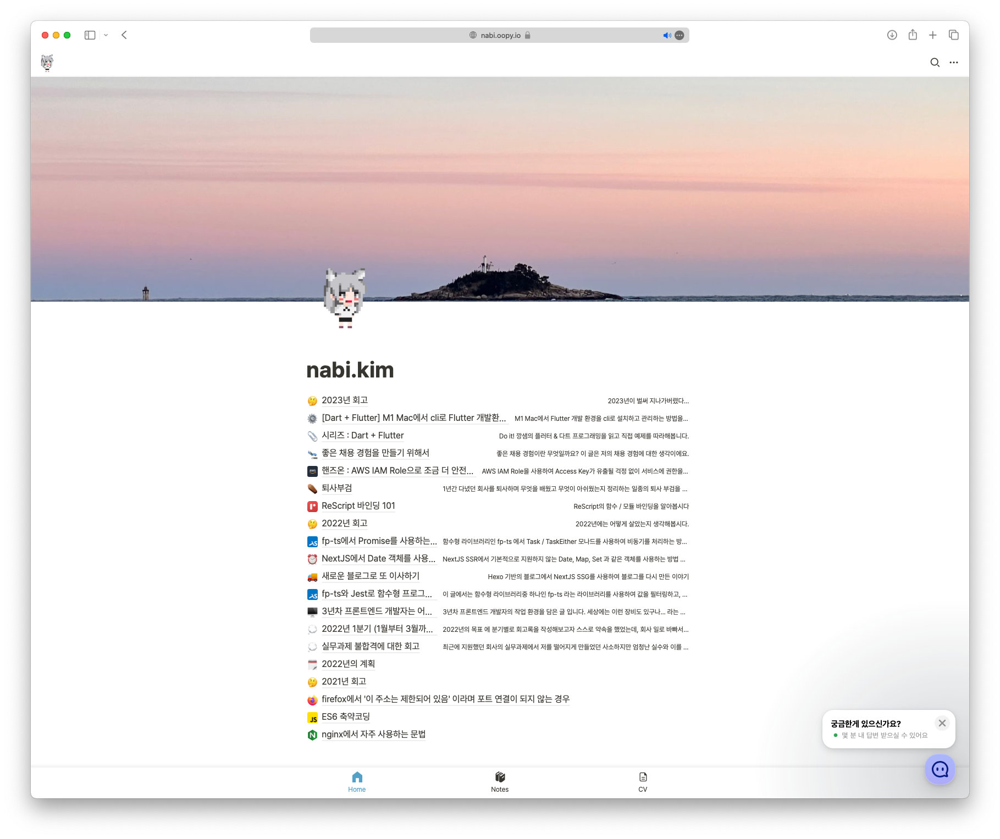

## 기술 블로그를 또! 이사하다

어쩌다보니, 기술블로그를 또 이사하게 되었습니다.
oopy는 충분히 좋은 블로그 플랫폼이였지만, 노션에서 모든 것을 벗어나지 못한다는 한계가 아쉬웠고...

결국 다시 이사를 하게 되었습니다.

하는김에 기술 블로그가 지금까지 어떻게 발전했는가에 대해서 조금 회고하는 시간을 가져보도록 하겠습니다.

### 2021년 (Hexo)

처음으로 만들어진 블로그입니다. Hexo를 통해 만들었고, Github Pages를 통해 배포했습니다.

당시에 템플릿 엔진을 극한으로 활용하여 꽤나 유려한 UX의 CV를 만들었던 기억이 납니다.

하지만 모든 극한의 활용이 그렇듯이, 한계를 만나게 되었고 마크다운에 억지로 HTML 서식을 집어넣기보다는 리액트 컴포넌트로 다시 만들어야 하겠다는 생각이 들었습니다.

### 2022년 (NextJS + Fp-Ts)

심플함이 최고라는 생각을 바탕으로, 스타일부터 디자인을 직접 만들었던 블로그였습니다.
완성도 측면에서는 이때의 블로그가 가장 높았다고 생각이 들긴 합니다.

fp-ts 라이브러리를 활용하여 함수형 기반의 SSG 로직을 구현했고, 이는 꽤나 성공적이였습니다.
유지보수가 어렵다는 점만 빼면 말이죠.

### 2023년 상반기 (NextJS + ReScript)

똑같은 블로그를 ReScript로 다시 만드려는 시도를 했습니다.

... 시도만 했습니다.

### 2023년 하반기 (oopy)

돌고돌아 우피로 다시 정착했습니다.

노션을 기반으로 만들어져 레이아웃이나 디자인에 신경을 쓰지 않아도 된다는 특징이 있었고,
이는 직접 구현에 지친 저에게 큰 안식이 되었습니다.

하지만, 노션이라는 틀을 벗어나지 못한다는 아쉬움은 언제나 저의 발목을 잡았고, 커스텀을 해보고 싶다! 라는 생각이 들기 시작했습니다.

### 2024년 (NextJS + Nextra)

블로그를 새로 만들기 위해 여정을 떠나던 도중, Nextra 라는 블로그 라이브러리를 발견했습니다.
이거다 싶었습니다. 지금 생각해보면 NextJS 기반의 블로그가 실패했었던 이유는 파일 라우팅부터 MDX 렌더링까지 모든 작업을 저 스스로 해야 했었기 때문이라고 생각했습니다.

그래서 MDX 렌더링과 기타등등을 모두 지원하는 Nextra가 꽤나 매력적으로 보였습니다.

물론 Nextra 스킨을 개조하는 데에는 큰 공이 들었지만, 이정도면 뿌듯한 UI가 나온것만 같습니다.

### 글을 마치며

늘 그렇듯이, 이 블로그는 oopy에서 천천히 마이그레이션을 할 계획입니다.

CV도 옮기고, 노트도 옮기고, 코드 스니펫도 옮기다 보면 올해 상반기가 다 지나갈것만 같습니다.

이번에 새로 태어난 2024년 블로그가 오래 가길 빌면서, 이만 글을 마치도록 하겠습니다.
